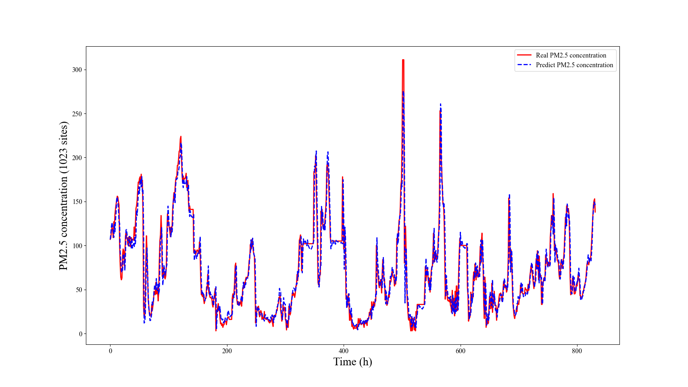

# Project Name
CDTDNet: A Neural Network for Capturing Deep Temporal Dependencies in Time Series

## Introduction
CDTDNet is a time series forecasting framework designed to extract deep 
temporal dependencies from sequential data. This project is the PyTorch implementation of CDTDNet and CSCRU. 
All files for the CDTDNet model are stored in the `/CDTDNet` folder, while all files for CSCRU are stored 
in the `/CSCRU` folder.

## Data
The raw data for the four datasets has been stored in the `/data` folder.

## Installation
Use the following command to install the required dependencies:
```bash
# Install using Conda environment
pip install -r requirements.txt
```

## Training
The training of CDTDNet is divided into two phases. The first phase is the training of 
CDTDNet (excluding the AE module). If you want to execute the first phase of training, please run the following command:
```bash
python CDTDNet_main.py
```
We have provided the pre-trained model files, which are stored in the `/CDTDNet/models` folder, along with the model's test files.
If you want to directly run the test file for CDTDNet (excluding the AE module), please execute the following command:
```bash
python CDTDNet_test_without_AE.py
```
The second phase is the training of the AE module, during which the model parameters of CDTDNet are frozen. 
If you want to execute the second phase of training, please run the following command:
```bash
python AE_main.py
```
We have also provided the pre-trained model and test files for the second phase. If you want to execute the test for 
the second phase, please run the following command:
```bash
python CDTDNet_test.py
```
The results tested on our machine are as follows:


If you want to run the training file for CSCRU, please execute the `main.py` file located in the `/CSCRU` folder with 
the following command:
```bash
python main.py
```
We have provided all the recurrent neural networks used in the experiments in the `/cscru/Recurrent_Neural_Network` 
folder. If you want to test the performance of other recurrent neural networks, please replace them in the `LSTM_Model.py` 
file.

## Hyperparameter tuning
If you want to perform Bayesian hyperparameter tuning for CDTDNet (excluding the AE component), 
please execute the following command:
```bash
python Hyparam_optimize.py
```
If you want to find the optimal hyperparameter configuration for the AE module, please execute the following command:
```bash
python Hyparam_optimize_AE.py
```
Please note that the results of model training, testing, and hyperparameter tuning may vary when run on different 
machines. Experimenting with different hyperparameter configurations may lead to more stable training of CDTDNet.